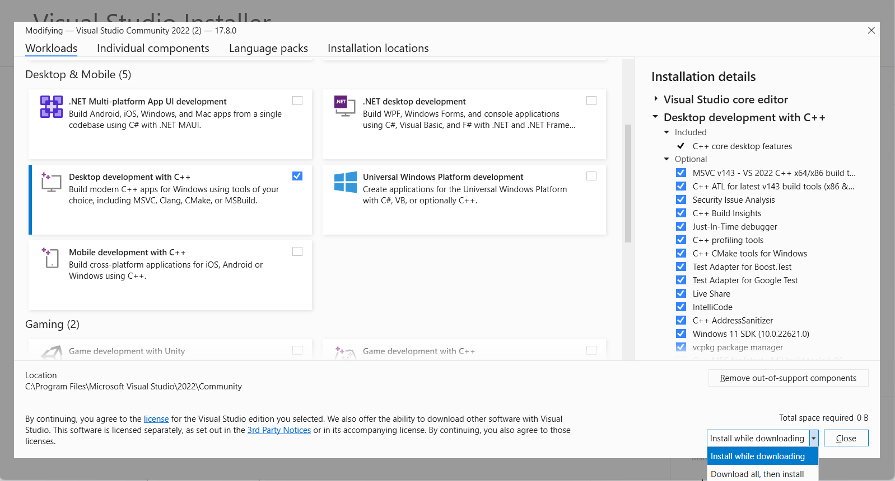

# Face_recognition_realtime
people detection and face recognition
<H1 align="center"> Steps For Installation </H1>

1. Install Anaconda.
2. Open Anaconda Prompt.
3. Create conda virtual environment
   - Conda create -n venv anaconda python==3.10.0
   - conda activate venv
  
5. You need to install Microsoft build tools from this link (or latest) https://aka.ms/vs/17/release/vs_BuildTools.exe 
Or from official website of Visual Studio Installer.
(If you have already installed Visual Studio Installer goto “Modify” option and continue the remaining steps)

6. Select “Desktop Development with C++”.
   

7. And Install
   

8. Install the required libraries in the virtual environment
   - numpy - 1.25.2
   - pandas - 2.0.3
   - matplotlib - 3.7.2
   - scipy - 1.11.1
   - jupyter- 1.0.0
   - opencv-python - 4.8.0
  
   - By running the command
   “pip3 install <package name>”

9. Install InsightFace
    - pip3 install insightface==0.7.3
  
11. Install opencv-python

12. Install onnxruntime (InsightFace Dependency)
    - pip3 install onnxruntime==1.15.1
    
11. Install Cuda 12.2
    - Sudo apt install nvidia-cuda-toolkit

13. Check InsightFace Installation.
    - Open Python in the Terminal
    - Run “import insightface”, properly installed, if it runs successfully.

14. Setting Up Redis Database.
    - Pip3 install redis-server  OR Download the “redis-x64-3.0.504.zip/” from “https://github.com/MicrosoftArchive/redis/releases” 
    - Extract the file and click on “redis-server” in the new directory.
    - Click on the file “redis-CLI” and type “ping”, it will result in “PONG”.
    - create a hkey in redis

 Note:-
	After creating a virtual environment using Anaconda, for activating a virtual environment you to open Anaconda Prompt and activate it by 
	 - conda activate <virtual_environment> 

<H1 align="center"> Steps For Running  </H1>

1. Activate the Virtual Environment and go to the project location.
2. for training create a folder a upload the videos of faces of individual with the name of the video as "name#emaild" after that run "video_training.py" file
3. After training is ompleted Run "object_detection.py" 
